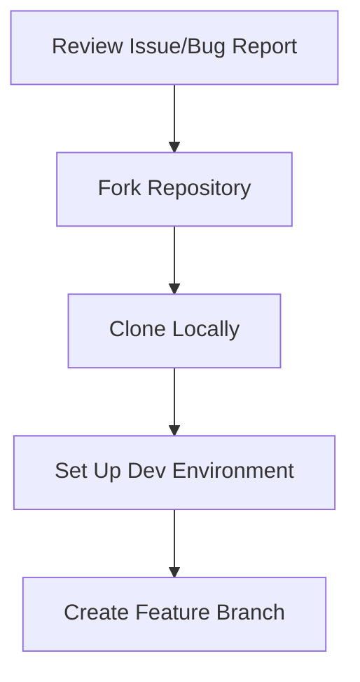
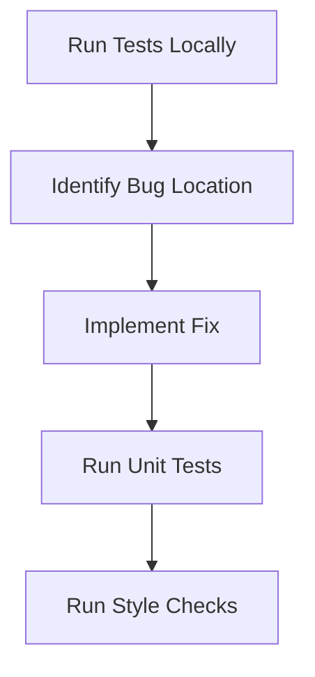
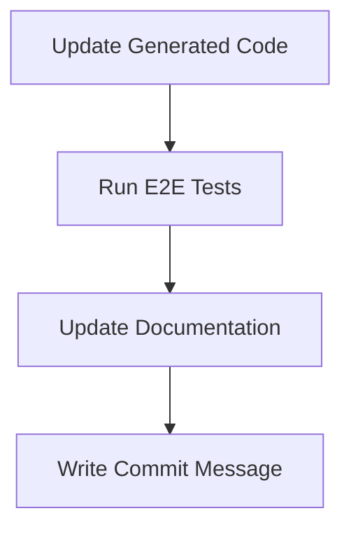
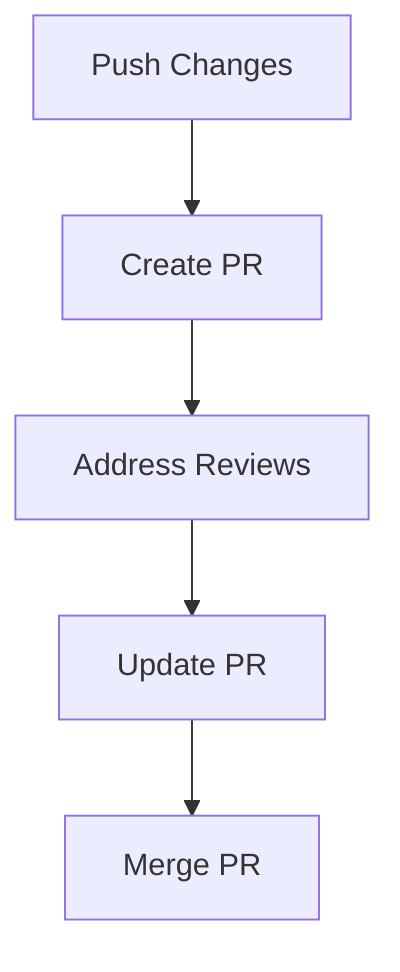

# Code Review, Bug Fix, and PR Workflow Guide

This guide outlines the standard workflow for reviewing code, fixing bugs, and submitting pull requests (PRs) to the AKS Engine project.

## 1. Initial Setup and Bug Review



### Steps:

1. **Review bug report in GitHub Issues**

   - Understand the problem description
   - Review any provided logs or error messages
   - Check if the issue is already being worked on

2. **Fork and Clone**

   ```bash
   go get github.com/Azure/aks-engine-azurestack
   cd $GOPATH/src/github.com/Azure/aks-engine-azurestack
   git remote add fork <your-fork-url>
   ```

3. **Create Feature Branch**
   ```bash
   git checkout -b fix/bug-description
   ```

## 2. Code Analysis and Fix Implementation



### Development Process:

1. **Analyze the Bug**

   - Run existing tests to reproduce the issue
   - Use VS Code with Go extension for debugging
   - Set breakpoints at suspected problem areas

2. **Implement Fix**

   - Follow Go coding conventions
   - Maintain consistent code style

   ```bash
   go fmt ./...
   ```

3. **Verify Changes**
   ```bash
   make test-style  # Check style conformance
   make test        # Run unit tests
   ```

## 3. Validation and Documentation



### Validation Steps:

1. **Update Generated Code**

   ```bash
   make build
   make ensure-generated
   ```

2. **Run E2E Tests**

   ```bash
   make test-kubernetes
   ```

   For specific test scenarios:

   ```bash
   ORCHESTRATOR_RELEASE=1.22 CLUSTER_DEFINITION=examples/kubernetes.json \
   SUBSCRIPTION_ID=$TEST_AZURE_SUB_ID \
   CLIENT_ID=$TEST_AZURE_SP_ID \
   CLIENT_SECRET=$TEST_AZURE_SP_PW \
   TENANT_ID=$TEST_AZURE_TENANT_ID \
   LOCATION=$TEST_AZURE_REGION \
   CLEANUP_ON_EXIT=false \
   make test-kubernetes
   ```

3. **Documentation**
   - Update relevant docs if needed
   - Add inline comments for complex logic
   - Write clear commit messages following convention

## 4. PR Submission and Review Process



### PR Process:

1. **Push Changes**

   ```bash
   git push fork fix/bug-description
   ```

2. **Create PR**

   - Title: Clear, concise description of the fix
   - Description:
     - Reference issue number
     - Explain the changes made
     - Include test results
     - List any breaking changes
   - Add appropriate labels

3. **Review Cycle**

   - CI/CD pipeline runs automated checks
   - AKS Engine team reviews code
   - Address feedback with additional commits
   - Request re-review after changes

4. **Final Steps**
   - Ensure all checks pass
   - Get required approvals
   - PR gets merged by maintainer

## Best Practices

1. **Code Quality**

   - Write clear, maintainable code
   - Follow project coding standards
   - Include appropriate error handling
   - Add/update tests as needed

2. **Communication**

   - Provide clear context in PR description
   - Respond promptly to review comments
   - Ask questions if requirements are unclear

3. **Testing**

   - Run all tests locally before pushing
   - Test edge cases
   - Verify changes in different scenarios

4. **Documentation**
   - Update docs affected by changes
   - Add comments for complex logic
   - Include examples if appropriate

## Common Issues and Solutions

### Generated Code

- If `make ensure-generated` fails:
  1. Run `make build` first
  2. Check for changes in `parts/` or `pkg/i8n/translations`
  3. Re-run `make ensure-generated`

### Testing

- For failing unit tests:
  1. Use `go test -v` for verbose output
  2. Debug with VS Code's Go extension
  3. Check test dependencies

### Style Checks

- For style check failures:
  1. Run `go fmt ./...`
  2. Verify imports are properly organized
  3. Check for common Go lint issues

## Additional Resources

- [Developer Guide](developer-guide.md)
- [Running Tests Guide](running-tests.md)
- [Release Process](release-checklist.md)
